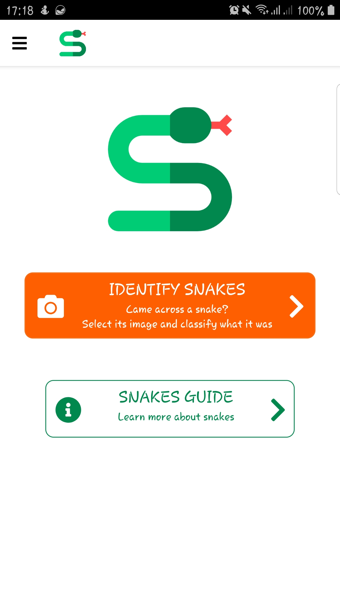
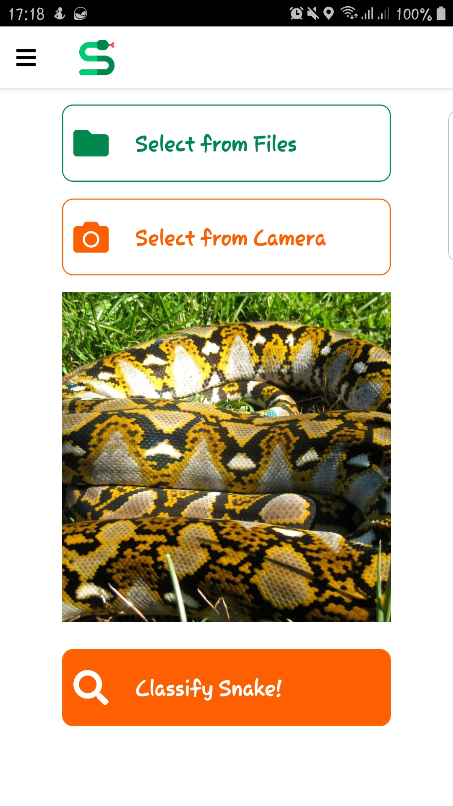
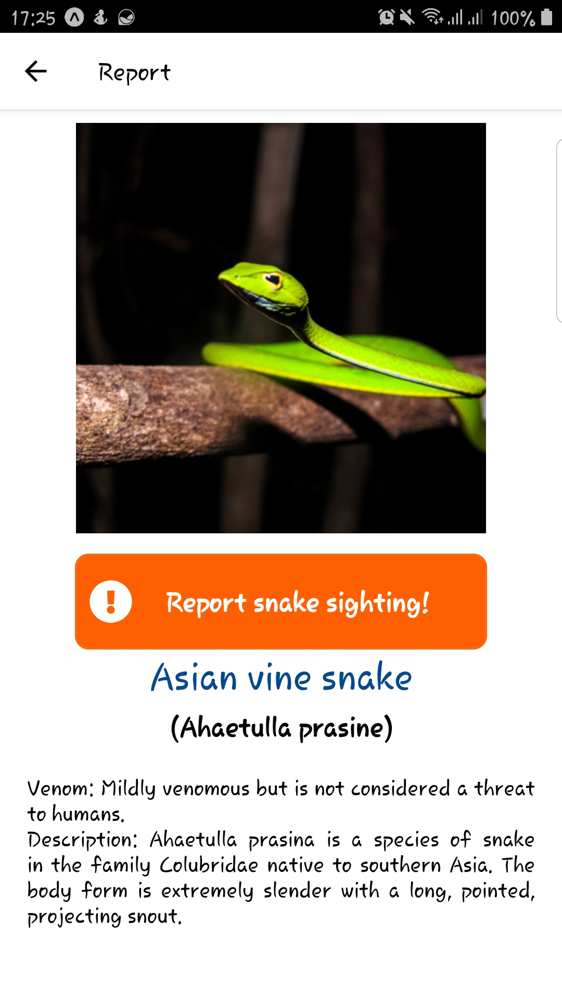

- [Expo link](https://expo.io/@hanstananda/projects/snake-classifier)

## About

This repository is the source code for the frontend system of SnakeClassifier FYP project. This project is built based on [react-native-boilerplate](https://github.com/WataruMaeda/react-native-boilerplate) by [Wataru Maeda](https://github.com/WataruMaeda). 


## How to Use

### Running for the first time
1.  Download zip or clone from the [Github repository](https://github.com/hanstananda/FYP-Front-End.git) and open the project directory: 
    ```bash
    cd FYP-Front-End
    ```
2.  Run `yarn install` or `npm install`
3.  If you have never setup Expo before, please follow the [instruction](https://expo.io/learn) to complete the setup. 
5.  Run the following command in terminal to start the application and follow the instructions provided in the terminal/ web page.  
    ```bash
    expo start
    ``` 

### Re-running the application
Run the following command in terminal to start the application and follow the instructions provided in the terminal/ web page.
```bash
expo start
```

## Deploying the application
This project has been setup with a [Github CI Action](https://github.com/features/actions) to automatically publish the latest version to the Expo site. Refer to the [Github code workflow](.github/workflows/main.yml) of this project for more details. 

Follow the instructions on [Expo standalone build guide](https://docs.expo.io/distribution/building-standalone-apps/) for detailed information of publishing an expo application. 
To build the expo application into an android `.apk` or `.aab` file, use the following command: 
```bash
expo build:android
```
Afterwards, follow the [Expo instructions](https://docs.expo.io/distribution/uploading-apps/) to upload the application to Google Play Store or App Store.

## Libraries

The following are the main libraries installed in this project:

- [expo](https://github.com/expo/expo)
- [react-navigation 4.x](https://github.com/react-navigation/react-navigation)
- [redux](https://github.com/reduxjs/redux)
- [redux-logger](https://github.com/LogRocket/redux-logger)
- [redux-thunk](https://github.com/reduxjs/redux-thunk)
- [moment](https://github.com/moment/moment)
- [axios](https://github.com/axios/axios)
- [react-native-vector-icons](https://github.com/oblador/react-native-vector-icons)
- [react-native-svg](https://github.com/react-native-community/react-native-svg)
- [expo-image-picker](https://docs.expo.io/versions/latest/sdk/imagepicker/)
- [expo-location](https://docs.expo.io/versions/latest/sdk/location/)

## Libraries for development

- [eslint](https://github.com/eslint/eslint)
- [prettier](https://github.com/prettier/prettier)
- [jest](https://jestjs.io/)
- [pre commit](https://github.com/observing/pre-commit)

## Additional Notes

#### Navigation

This project used drawer navigation as the main navigation. Here in the [code](/src/routes/navigation), files are separated by the navigation types. 

#### Authentication

In this project, the authentication & authorization is done using [React Context](https://reactjs.org/docs/context.html) and Axios token header. Refer the login implementation under the `src/scenes/profile/LoginProfile.js`. 

#### Redux

Redux can contain global state of the app. This is very useful but on the other hand, it takes time to setup if you are not familiar with it. In the boilerplate, you see [module file](/src/modules/app.module.js) which contains actions, reducer and store in a file. To connect with actions and state from component, you need to call [connector](/src/utils/connector.js). You can use actions and state from props. 

Here is an [example](https://github.com/WataruMaeda/react-native-boilerplate/blob/master/src/routes/Routes.js#L10-L15). To combine reducer, first you can add another module file then import in connector like this [code](https://github.com/WataruMaeda/react-native-boilerplate/blob/master/src/utils/connector.js#L41-L42). Lastly import module in [store](https://github.com/WataruMaeda/react-native-boilerplate/blob/master/src/utils/store.js#L21) as well.

#### Assets

Images, icons and fonts are controlled under [theme](https://github.com/WataruMaeda/react-native-boilerplate/tree/master/src/theme). If you add new assets, you need to import the new assets in each files to access the assets from theme. Also, assets preloading is implemented as well. You can also use svg file in the boilerplate. All the assets are ready to use by importing theme.

#### Absolute path

If your project structure become complicated and has a lot of nested folders, you will have problem with relative paths. In the boilerplate, you can use absolute paths. You can write simple import statement i.e 'components/Button'. No more ../../../components/Button. The configuration is written in `babel.config.js`.

#### Code formatting, fixing and testing on pre commit

It's very important to keep code clean to maintain readability and productivity. In the boilerplate, Eslint, Prettier and Jest configuration are done. It's continuously checking and format your code while you coding (Please enable "Format on Save" option if you prefer to format code after save change). After you submit changes, pre commit script will run to handle checking and formatting your code, run test. If the 3 steps are passed, you will be able to push the change.

## Licence

This project is available under the MIT license. See the [LICENSE](LICENSE) file for more info. 
The snake logo is provided by [Flaticon](https://www.flaticon.com/). 
Other icons are provided by [Font Awesome](https://fontawesome.com/). 
Snake images used are taken from Wikipedia and iNaturalist. 

